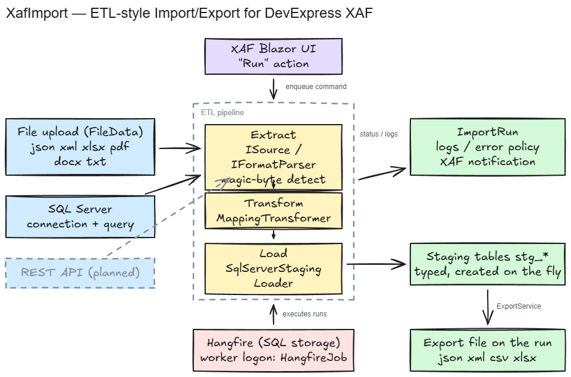

# XafImport

**Proof of concept: ETL-style import/export for DevExpress XAF**, with Hangfire background
jobs and manually triggered runs. Built as a reusable XAF module (`XafImport.Module`) — the
Blazor Server app in this repo is just the test harness.



*(Editable source: [docs/architecture.excalidraw](docs/architecture.excalidraw))*

## What it does

- **Import from files** — json, xml, xlsx/xls, pdf, docx, txt. Format detection by **magic
  bytes** (zip-content inspection for xlsx vs docx), never by extension. Excel/PDF/Word
  parsing via the DevExpress Office File API.
- **Import from SQL Server** — connection string + query on the definition; the result-set
  schema drives the staging table with real column types, streamed (no buffering).
- **Staging-first** — imports never write business objects directly. Every run lands in a
  `stg_<definition>` table created on the fly from the discovered schema (add-only column
  evolution, truncate per run).
- **Export** — run a SQL query (against the app DB by default, so staging tables and
  business-object tables both work) and write the result as json, xml, csv, or xlsx — the
  file is attached to the run, downloadable from the UI.
- **Background or manual** — one "Run" action on the definition; execution goes through
  Hangfire (SQL Server storage, worker authenticates into XAF as a service user) or inline
  when `Jobs:UseHangfire=false`.
- **Operational basics** — per-run log entries visible in the XAF UI, per-definition error
  policy (skip-and-continue with a max-errors cap, or abort), and run-completion
  notifications through XAF's built-in Notifications module.
- **Column mapping** — rename mapping (JSON) applied between extract and load.

Everything above is verified end-to-end (Playwright against the running Blazor app, plus
SQL-level checks of staged data), including a full round-trip: JSON file → staging table →
CSV export.

## Running the POC

Prerequisites: .NET 10 SDK, SQL Server LocalDB, DevExpress **Universal** NuGet feed
configured (v26.1 — Office File API is used for xlsx/pdf/docx).

```bash
dotnet run --project XafImport/XafImport.Blazor.Server
```

First DEBUG run updates/seeds the database automatically (child-process `--updateDatabase`,
see below). Log in as `Admin` (empty password). Create an *Import Definition*, attach a
file (or set SQL connection + query), hit **Run**, and watch *Import Runs*.

Dev smoke endpoints (Development only): `/dev/test-import?fmt=json|xml|txt|xlsx|docx|pdf|sql|jsonbad|export`
push a sample through the real Hangfire → pipeline → staging path. The Hangfire dashboard
is at `/hangfire` (Development only).

## For fellow XAF developers

The interesting part is the module, not the harness:

- **[docs/module-integration.md](docs/module-integration.md)** — the drop-in checklist for
  adding `XafImport.Module` to an existing XAF Blazor app (module registration, DbSets,
  `AddXafImportPipeline()`, Hangfire wiring, service-user hardening), plus a table of the
  known POC ceilings and their upgrade paths.
- **[docs/etl-architecture.md](docs/etl-architecture.md)** — the design decisions: why
  staging tables are plain SQL DDL instead of runtime XAF entities, and the
  `ISource` / `IFormatParser` / `IStagingLoader` contracts.

Traps this POC hit so you don't have to:

- Running XAF's `IDBUpdater` in-process and then serving **corrupts the application model**
  (`ModelNode.GetNode` index errors on every view). `--updateDatabase` is a separate run by
  design — spawn it as a child process if you need update-before-serve (see `Program.cs`).
- Hangfire workers start with the host, but XAF's database update normally waits for a user
  to open the app — on a fresh DB the job service user doesn't exist yet and every job fails
  its logon. Same fix as above.
- A `FileData` property renders as dead, disabled fields unless you add
  `[ExpandObjectMembers(ExpandObjectMembers.Never)]`.
- The scaffold's `DatabaseVersionMismatch` handler only auto-updates when a **debugger is
  attached** — `dotnet run` isn't enough.
- New non-nullable columns are backfilled with defaults (`false`/`0`) for existing rows;
  property initializers only apply to new objects.

## Backburner

Open work is tracked on a (private) ContextBoard project; ideas not yet built:

- **REST API as import source** (card exists) — GET + JSON through the existing pipeline.
- **AI-assisted definitions** — describe the desired import/export in chat; AI drafts the
  definition + column mapping for review (drafting only, never in the execution path).
- Promote step: staging → business objects with mapping.
- Scheduled runs: sync `ImportDefinition.CronExpression` to Hangfire recurring jobs.
- Encrypted credentials at rest (connection strings / API keys).
- Streaming parsers for large files; staging retention instead of truncate-per-run.
- Transform beyond rename: type conversion, expressions, lookups.
- Per-user notifications; export targets beyond files (SQL, API).
- "Preview staging" grid on the run detail view.

## License / status

POC quality — deliberate shortcuts are marked with `ponytail:` comments in code and listed
in [docs/module-integration.md](docs/module-integration.md). Requires a DevExpress Universal
(or Office File API) license for the document parsers.
